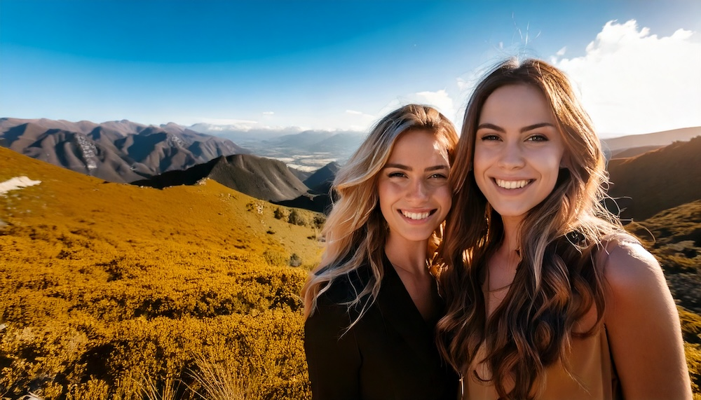
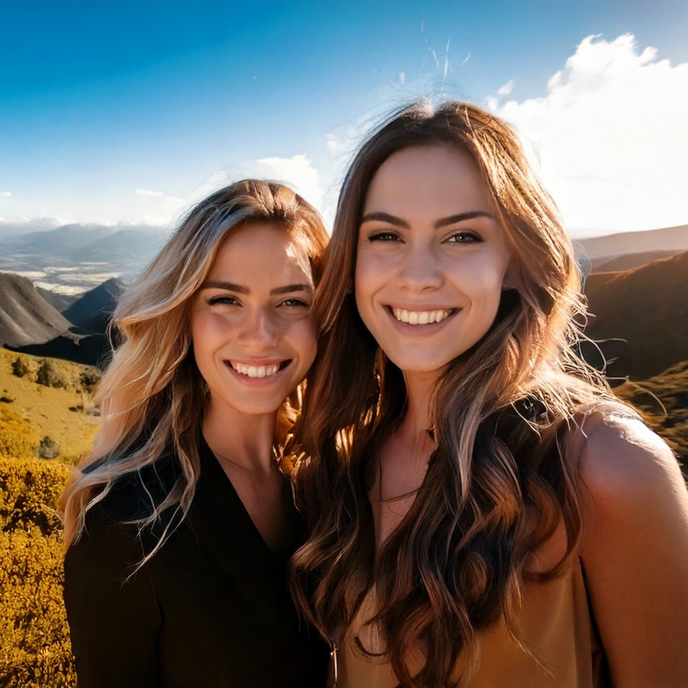
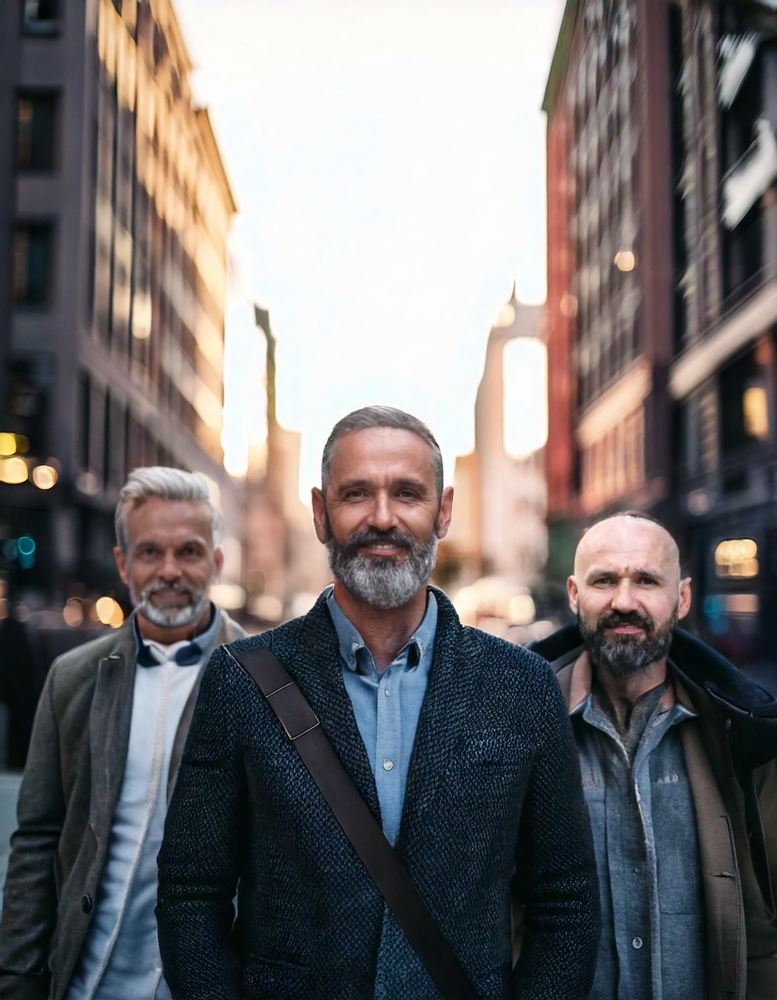
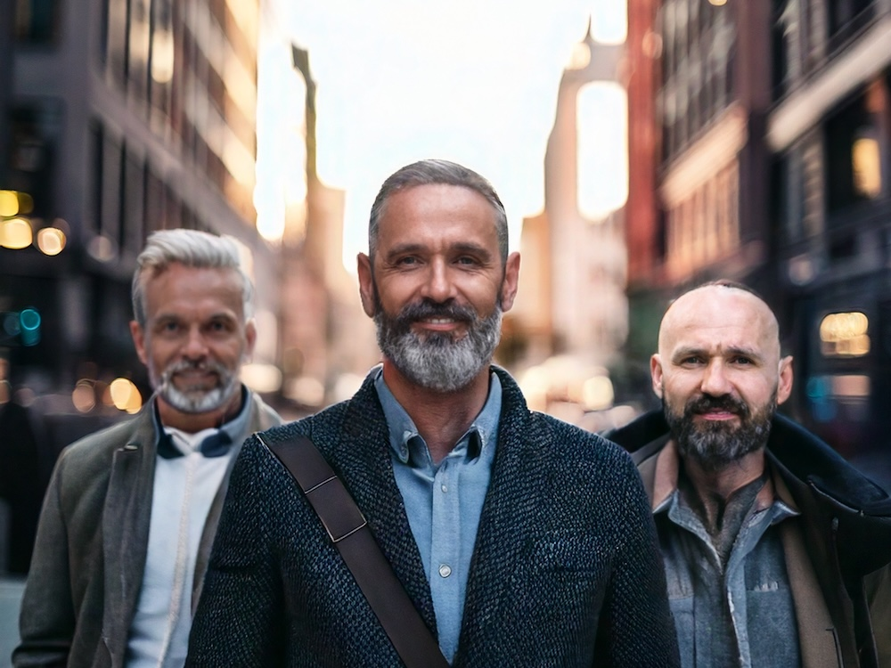
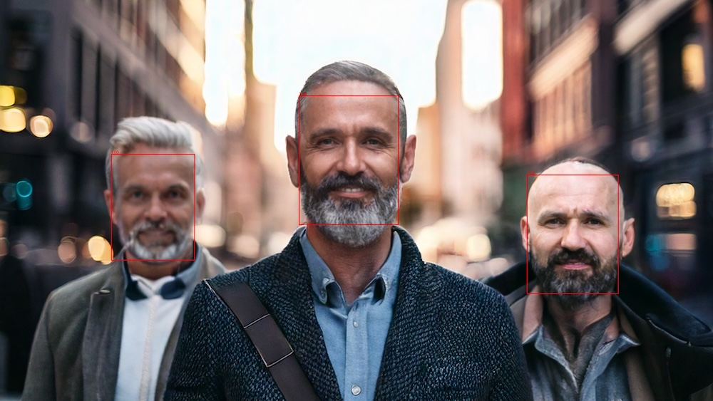

# Smart Crop

A Python tool for batch processing photos that intelligently crops them to any aspect ratio while preserving the most important parts of each image. Perfect for processing large collections of photos, it uses MTCNN for accurate face detection and automatically centers the crop on detected faces, making it ideal for group photos and portraits.

## Features

- 📸 Batch process multiple images in parallel
- 👤 Accurate face detection using MTCNN
- 🔄 Automatic EXIF orientation correction
- 📐 Custom aspect ratio support (e.g., 16:9, 4:3)
- ⚡ Multi-processing for faster batch processing
- 💾 Preserves EXIF data in output images
- 🎯 Smart face-based centering
- 🔍 Visual face detection debugging
- ⏱️ Skip existing files to save time

## Visual Demonstration

### Group Photo Example
| Original | Processed (Square) | 
|----------|-------------------|
|  |  

### Portrait Example
| Original | Processed (4:3) |
|----------|-------------------|
|  |  |

### Face Detection Visualization
For the curious, you can turn on visualization of the detected faces by passing `--show-faces`


> Note: The example images above demonstrate how Smart Crop handles different scenarios:
> - Group photos: Centers on the average position of all faces
> - Portraits: Centers on the main subject
> - Landscapes: Maintains composition when no faces are present

## Requirements

- Python 3.8 or higher
- Required packages (install with `pip install -r requirements.txt`):
  - Pillow
  - mtcnn
  - piexif
  - tqdm
  - tensorflow
  - setuptools

## Installation

1. Clone this repository
2. Install the required packages:
   ```bash
   pip install -r requirements.txt
   ```

## Usage

### Basic Batch Processing
Simply place your photos in the input directory and run:
```bash
python crop.py
```

### Advanced Batch Processing Options

- `--input-dir`: Input directory containing images (default: "photos")
- `--output-dir`: Output directory for processed images (default: "output")
- `--ratio`: Crop ratio in format width:height (e.g., "16:9", "4:3"). Default is square
- `--show-faces`: Show face detection boxes and confidence scores on output images
- `--workers`: Number of worker processes (default: number of CPU cores)
- `--overwrite`: Overwrite existing files in output directory

### Batch Processing Examples

Process all images with face detection visualization:
```bash
python crop.py --show-faces
```

Process all images with custom aspect ratio:
```bash
python crop.py --ratio 16:9
```

Process all images with all options:
```bash
python crop.py --input-dir my_photos --output-dir processed_photos --ratio 16:9 --show-faces --workers 4 --overwrite
```

## How it Works

### Face Detection and Centering

The tool uses MTCNN (Multi-task Cascaded Convolutional Networks) for accurate face detection. When processing an image:

1. Detects all faces in the image with high confidence (95% threshold)
2. For multiple faces:
   - Calculates the center point of all detected faces
   - Centers the crop on this average position
   - Ensures all faces are included in the final crop
3. For single faces:
   - Centers the crop on the detected face
4. If no faces are detected:
   - Falls back to center crop of the image

This intelligent centering ensures that:
- Group photos keep all faces in frame
- Portraits are properly centered on the subject
- Landscape photos maintain their composition when no faces are present

### Batch Processing Optimization

- Multi-processing support for parallel batch processing
- Images are automatically resized for faster face detection while maintaining accuracy
- Skips existing files by default to save time on large batches
- Progress bar shows batch processing status
- Efficient memory usage for large photo collections

## Directory Structure

```
.
├── photos/           # Input directory (default)
│   └── *.jpg        # Your photos to process
├── output/          # Output directory (default)
│   └── *.jpg        # Processed photos
├── examples/        # Example images for documentation
├── crop.py
└── requirements.txt
```

## Notes

- The script processes JPG and PNG files in batch
- Face detection confidence threshold is set to 95% to reduce false positives
- Images are automatically resized for faster face detection while maintaining accuracy
- EXIF orientation data is preserved in the output images
- Existing files are skipped by default unless `--overwrite` is used
- Perfect for processing large collections of photos efficiently 